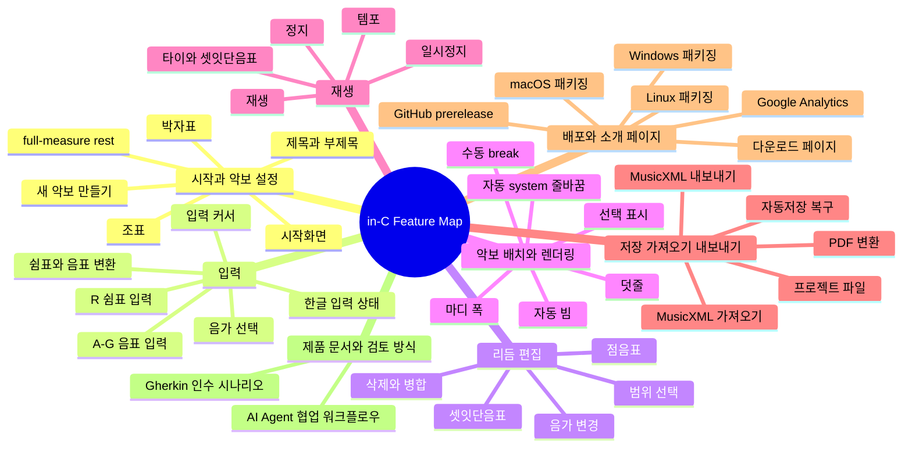

# 피쳐맵

이 문서는 현재 제품이 어떤 기능 영역으로 구성되어 있는지 보여주는 얇은 지도다.
로드맵, 우선순위, TODO, 의사결정 근거는 다루지 않는다. 남은 작업과 논의는
GitHub 이슈에 남기고, 구체 동작 검토 기준은 `docs/product/acceptance/*.feature`
에 둔다.

## 전체 지도

## 상세 표 바로가기

- [시작과 악보 설정](#시작과-악보-설정)
- [입력](#입력)
- [리듬 편집](#리듬-편집)
- [악보 배치와 렌더링](#악보-배치와-렌더링)
- [재생](#재생)
- [저장, 가져오기, 내보내기](#저장-가져오기-내보내기)
- [배포와 소개 페이지](#배포와-소개-페이지)
- [제품 문서와 검토 방식](#제품-문서와-검토-방식)

## 상태 값

- `지원`: 현재 앱에서 기본 흐름을 사용할 수 있다.
- `부분 지원`: 동작은 있으나 예외 상황, UX, 자동화, 확장성이 아직 부족하다.
- `미지원`: 아직 사용자 기능으로 제공하지 않는다.
- `실험`: 방향을 검증 중인 기능이나 문서 체계다.
- `보류`: 현재 방향에서는 의도적으로 뒤로 미룬다.

인수 시나리오가 `없음`인 항목은 아직 사용자 동작 검토 대상이 아니거나,
별도 이슈에서 기준을 정하기 전까지 보류한 기능이다.

## 시작과 악보 설정

| 기능 | 현재 상태 | 인수 시나리오 | 관련 문서 |
| --- | --- | --- | --- |
| 시작화면 | 지원 | `docs/product/acceptance/start-and-recovery.feature` | `docs/architecture/project-file.md` |
| 새 악보 만들기 | 지원 | `docs/product/acceptance/score-setup.feature` | `docs/research/single-voice-mvp-requirements.md` |
| 제목과 부제목 수정 | 지원 | `docs/product/acceptance/score-setup.feature` | `docs/research/single-voice-mvp-requirements.md` |
| 박자표 선택 | 지원 | `docs/product/acceptance/score-setup.feature` | `docs/research/single-voice-mvp-requirements.md` |
| 조표 선택 | 지원 | `docs/product/acceptance/score-setup.feature` | `docs/research/single-voice-mvp-requirements.md` |
| 생성 후 박자표 변경 | 부분 지원 | `docs/product/acceptance/score-setup.feature` | `docs/architecture/rhythmic-timeline.md` |
| 생성 후 조표 변경 | 부분 지원 | `docs/product/acceptance/score-setup.feature` | `docs/musicxml-mvp.md` |
| full-measure rest 실제 길이 처리 | 부분 지원 | `docs/product/acceptance/rest-to-note.feature` | `docs/architecture/rhythmic-timeline.md` |

## 입력

| 기능 | 현재 상태 | 인수 시나리오 | 관련 문서 |
| --- | --- | --- | --- |
| 음가 선택 | 지원 | `docs/product/acceptance/note-input.feature` | `docs/architecture/note-input-state.md` |
| `A`-`G` 음표 입력 | 지원 | `docs/product/acceptance/note-input.feature` | `docs/architecture/note-input-state.md` |
| 선택 음표 음높이 변경 | 지원 | `docs/product/acceptance/note-input.feature` | `docs/architecture/note-input-state.md` |
| 선택 쉼표를 음표로 변환 | 지원 | `docs/product/acceptance/rest-to-note.feature` | `docs/architecture/note-input-state.md` |
| `R` 쉼표 입력과 변환 | 지원 | `docs/product/acceptance/note-input.feature` | `docs/architecture/note-input-state.md` |
| 마지막 이벤트 뒤 입력 커서 | 지원 | `docs/product/acceptance/note-input.feature` | `docs/architecture/note-input-state.md` |
| 한글 입력 상태의 핵심 단축키 | 부분 지원 | `docs/product/acceptance/note-input.feature`, `docs/product/acceptance/rest-to-note.feature` | `docs/brand/korean-product-language.md` |

## 리듬 편집

| 기능 | 현재 상태 | 인수 시나리오 | 관련 문서 |
| --- | --- | --- | --- |
| 선택 이벤트 음가 변경 | 지원 | `docs/product/acceptance/rhythm-duration.feature` | `docs/architecture/rhythm-editing-transactions.md` |
| 짧아진 음가의 남은 시간 쉼표 채움 | 지원 | `docs/product/acceptance/rhythm-duration.feature` | `docs/architecture/rhythm-editing-transactions.md` |
| 길어진 음가의 뒤 이벤트 소비 | 지원 | `docs/product/acceptance/rhythm-duration.feature` | `docs/architecture/rhythm-editing-transactions.md` |
| `Backspace` 삭제와 앞 이벤트 병합 | 지원 | `docs/product/acceptance/delete-event.feature` | `docs/architecture/delete-rest-policy.md` |
| 첫 이벤트 삭제와 뒤 이벤트 당김 | 지원 | `docs/product/acceptance/delete-event.feature` | `docs/architecture/delete-rest-policy.md` |
| 타이 인접 구간 삭제 | 지원 | `docs/product/acceptance/delete-event.feature` | `docs/architecture/ties-and-measure-splitting.md` |
| 점음표와 겹점음표 | 지원 | `docs/product/acceptance/augmentation-dots.feature` | `docs/architecture/augmentation-dots.md` |
| 셋잇단음표 기본 입력 | 지원 | `docs/product/acceptance/tuplets.feature` | `docs/architecture/tuplets.md` |
| 셋잇단음표 해제와 예외 안내 | 부분 지원 | `docs/product/acceptance/tuplets.feature` | `docs/architecture/tuplets.md` |
| 범위 선택 기반 삭제와 일괄 편집 | 부분 지원 | `docs/product/acceptance/range-selection.feature` | `docs/architecture/measure-selection.md` |

## 악보 배치와 렌더링

| 기능 | 현재 상태 | 인수 시나리오 | 관련 문서 |
| --- | --- | --- | --- |
| 자동 system 줄바꿈 | 지원 | `docs/product/acceptance/layout-rendering.feature` | `docs/architecture/measure-systems.md` |
| system 마지막 마디 폭 채움 | 지원 | `docs/product/acceptance/layout-rendering.feature` | `docs/architecture/measure-systems.md` |
| 내용 기반 마디 폭 계산 | 지원 | `docs/product/acceptance/layout-rendering.feature` | `docs/architecture/measure-systems.md` |
| 기본 자동 빔 | 지원 | `docs/product/acceptance/layout-rendering.feature` | `docs/architecture/automatic-beaming.md` |
| 복잡한 박자와 리듬의 빔 안정성 | 부분 지원 | `docs/product/acceptance/layout-rendering.feature` | `docs/architecture/automatic-beaming.md` |
| 오선 밖 음표와 덧줄 렌더링 | 지원 | `docs/product/acceptance/layout-rendering.feature` | `docs/testing/single-voice-mvp-regression.md` |
| 선택 이벤트와 입력 커서 표시 | 지원 | `docs/product/acceptance/layout-rendering.feature` | `docs/architecture/note-input-state.md` |
| 수동 system/page break | 미지원 | 없음 | `docs/architecture/measure-systems.md` |

## 재생

| 기능 | 현재 상태 | 인수 시나리오 | 관련 문서 |
| --- | --- | --- | --- |
| 재생 | 지원 | `docs/product/acceptance/playback.feature` | `docs/research/single-voice-mvp-requirements.md` |
| 일시정지 | 지원 | `docs/product/acceptance/playback.feature` | `docs/research/single-voice-mvp-requirements.md` |
| 정지 | 지원 | `docs/product/acceptance/playback.feature` | `docs/research/single-voice-mvp-requirements.md` |
| 템포 조절 | 지원 | `docs/product/acceptance/playback.feature` | `docs/research/single-voice-mvp-requirements.md` |
| 타이와 셋잇단음표 playback 반영 | 부분 지원 | `docs/product/acceptance/playback.feature` | `docs/testing/single-voice-mvp-regression.md` |
| 재생 커서와 편집 선택 동기화 | 부분 지원 | `docs/product/acceptance/playback.feature` | `docs/testing/single-voice-mvp-regression.md` |

## 저장, 가져오기, 내보내기

| 기능 | 현재 상태 | 인수 시나리오 | 관련 문서 |
| --- | --- | --- | --- |
| MusicXML 가져오기 | 지원 | `docs/product/acceptance/import-export.feature` | `docs/musicxml-mvp.md` |
| MusicXML 내보내기 | 지원 | `docs/product/acceptance/import-export.feature` | `docs/musicxml-mvp.md` |
| PDF 변환 | 지원 | `docs/product/acceptance/import-export.feature` | `docs/musicxml-mvp.md` |
| 앱 내부 자동저장 복구 | 지원 | `docs/product/acceptance/start-and-recovery.feature` | `docs/architecture/project-file.md` |
| 전용 프로젝트 파일 | 보류 | 없음 | `docs/architecture/project-file.md` |
| 최근 파일과 예제 악보 진입점 | 미지원 | 없음 | `docs/architecture/project-file.md` |

## 배포와 소개 페이지

| 기능 | 현재 상태 | 인수 시나리오 | 관련 문서 |
| --- | --- | --- | --- |
| GitHub prerelease | 지원 | `docs/product/acceptance/distribution-download.feature` | `docs/distribution.md` |
| macOS 패키징 | 지원 | `docs/product/acceptance/distribution-download.feature` | `docs/distribution.md` |
| Windows 패키징 | 지원 | `docs/product/acceptance/distribution-download.feature` | `docs/distribution.md` |
| Linux 패키징 | 지원 | `docs/product/acceptance/distribution-download.feature` | `docs/distribution.md` |
| 다운로드 페이지 | 지원 | `docs/product/acceptance/distribution-download.feature` | `docs/site.md` |
| Google Analytics 기본 이벤트 | 지원 | `docs/product/acceptance/distribution-download.feature` | `docs/site.md` |

## 제품 문서와 검토 방식

| 기능 | 현재 상태 | 인수 시나리오 | 관련 문서 |
| --- | --- | --- | --- |
| Gherkin 인수 시나리오 | 실험 | `docs/product/acceptance/rest-to-note.feature` | `docs/product/acceptance/README.md` |
| AI Agent 협업 워크플로우 | 실험 | 없음 | `docs/product/agent-workflow.md` |
