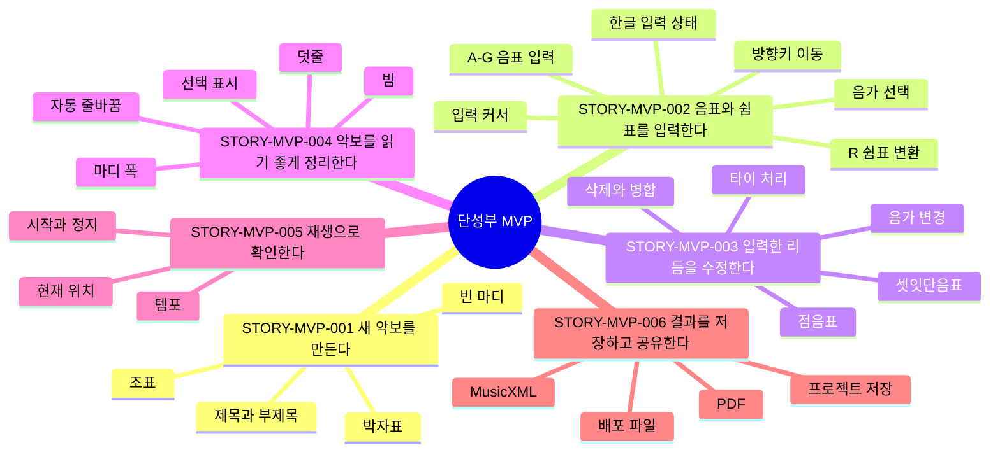

# 제품 스토리 맵

이 문서는 in C의 현재 사용자 여정과 제품 기준을 한눈에 보기 위한 지도다.
긴 히스토리나 논쟁을 남기는 문서가 아니라, 지금 합의된 상태만 유지한다.

## 문서 용도

- MVP와 이후 기능을 사용자 여정 기준으로 판단한다.
- 이슈 작업 전후로 어떤 사용자 흐름이 바뀌는지 확인한다.
- 사람과 AI Agent가 같은 제품 기준을 보고 작업하게 한다.
- 테스트 문서와 자동 검증이 어떤 사용자 성공 흐름을 보호하는지 연결한다.

## 관리 원칙

- 이 문서에는 현재 기준만 남긴다.
- 변경 배경, 논의, 히스토리는 GitHub 이슈와 PR에 남긴다.
- 스토리가 먼저 바뀌어야 하면 변경 제안 이슈를 만든다.
- 작업 중 기준이 바뀌면 해당 이슈 댓글로 보강한다.
- PR에서는 이 문서의 기준 변경 여부를 확인한다.
- 기준이 바뀌었다면 PR 안에 이 문서 변경을 포함한다.

## 스토리 ID 규칙

스토리 ID는 `STORY-{AREA}-{NNN}` 형식을 쓴다.

- `MVP`: 단성부 MVP 사용자 여정
- `EDIT`: 편집 경험 전반
- `LAYOUT`: 악보 배치와 사보 품질
- `IO`: 저장, 불러오기, 내보내기
- `PLAY`: 재생과 청취 확인

한 번 사용한 ID는 의미가 크게 바뀌어도 재사용하지 않는다. 스토리가 폐기되면
이 문서에서 제거하고, 폐기 이유는 관련 이슈에 남긴다.

## 단성부 MVP 지도

## 현재 스토리 기준

스토리 항목은 `사용자 기준`, `현재 기준`, `관련 문서`만 유지한다. 변경 기록,
논쟁, 대안은 관련 이슈와 PR에 남긴다.

### STORY-MVP-001: 새 악보를 만든다

사용자는 빈 악보에서 시작해 제목, 박자표, 조표가 있는 단성부 악보를 만들 수
있어야 한다.

현재 기준:

- 새 악보 생성 시 박자표와 조표를 선택할 수 있다.
- 생성된 악보의 제목과 부제목을 수정할 수 있다.
- 비어 있는 마디는 해당 박자표의 한 마디 전체를 나타내는 쉼표로 보인다.
- full-measure rest는 실제 박자 길이와 표기 관례를 구분해 다룬다.

관련 문서:

- `docs/research/single-voice-mvp-requirements.md`
- `docs/architecture/rhythmic-timeline.md`

### STORY-MVP-002: 음표와 쉼표를 입력한다

사용자는 키보드 중심으로 음표와 쉼표를 입력하고, 마지막 이벤트 이후에도 자연스럽게
새 입력 위치로 이동할 수 있어야 한다.

현재 기준:

- 숫자키 `1`-`5` 또는 툴바로 현재 음가를 선택한다.
- 음표 선택 상태에서 `A`-`G`를 누르면 선택 음표의 음높이가 바뀐다.
- 쉼표 선택 상태에서 `A`-`G`를 누르면 같은 음가의 음표로 바뀐다.
- 음표 또는 쉼표 선택 상태에서 `R`을 누르면 같은 음가의 쉼표로 바뀐다.
- 마지막 이벤트에서 오른쪽 화살표를 누르면 새 입력 커서가 표시된다.
- 새 입력 커서에서 `A`-`G`를 누르면 현재 음가의 음표가 추가된다.
- 새 입력 커서에서 `R`을 누르면 현재 음가의 쉼표가 추가된다.
- 한글 입력 상태에서도 핵심 단축키가 동작해야 한다.

관련 문서:

- `docs/architecture/note-input-state.md`
- `docs/brand/korean-product-language.md`

### STORY-MVP-003: 입력한 리듬을 수정한다

사용자는 이미 입력된 음표와 쉼표의 길이를 바꾸고, 삭제하고, 점음표와 셋잇단음표를
다룰 수 있어야 한다.

현재 기준:

- 선택한 음표나 쉼표의 음가는 직접 바꿀 수 있다.
- 짧게 바꾼 뒤 남는 시간은 유효한 쉼표로 채운다.
- 길게 바꿀 때는 뒤 이벤트를 소비하거나, 불가능한 경우 명확히 거부한다.
- `Backspace`는 음표를 쉼표로 바꾸지 않는다.
- 삭제된 길이는 앞 이벤트에 가산한다.
- 악보 첫 이벤트를 삭제하면 뒤 이벤트가 앞으로 당겨진다.
- 셋잇단음표는 선택 상태와 입력 커서 상태 모두에서 다룰 수 있어야 한다.
- 셋잇단음표를 다시 토글하면 해제할 수 있어야 한다.

관련 문서:

- `docs/architecture/delete-rest-policy.md`
- `docs/architecture/rhythm-editing-transactions.md`
- `docs/architecture/augmentation-dots.md`
- `docs/architecture/tuplets.md`
- `docs/architecture/ties-and-measure-splitting.md`

### STORY-MVP-004: 악보를 읽기 좋게 정리한다

사용자는 입력한 악보를 읽을 수 있는 오선보로 확인할 수 있어야 한다.

현재 기준:

- system 줄바꿈은 자동으로 적용된다.
- 각 system의 마지막 마디도 사용 가능한 전체 폭을 채운다.
- 마디 폭은 음악 내용과 최소 간격을 모두 고려한다.
- 8분음표 이하 음표는 박자 구조를 기준으로 자동 빔 처리된다.
- 오선 범위를 벗어난 음표도 덧줄과 함께 잘리지 않아야 한다.
- 선택된 이벤트와 입력 커서는 시각적으로 구분되어야 한다.

관련 문서:

- `docs/architecture/measure-systems.md`
- `docs/architecture/automatic-beaming.md`
- `docs/architecture/measure-selection.md`

### STORY-MVP-005: 재생으로 확인한다

사용자는 작성 중인 악보를 재생해 길이와 흐름을 확인할 수 있어야 한다.

현재 기준:

- 재생, 일시정지, 정지를 사용할 수 있다.
- 템포를 조절할 수 있다.
- 재생 중에도 선택과 입력 상태가 예측 가능하게 유지되어야 한다.
- 타이와 셋잇단음표가 실제 재생 길이에 반영되어야 한다.

관련 문서:

- `docs/research/single-voice-mvp-requirements.md`
- `docs/testing/single-voice-mvp-regression.md`

### STORY-MVP-006: 결과를 저장하고 공유한다

사용자는 작성한 악보를 보관하고, 다른 도구나 사람과 공유할 수 있어야 한다.

현재 기준:

- 프로젝트 파일을 저장하고 다시 열 수 있어야 한다.
- MusicXML로 가져오기와 내보내기를 할 수 있어야 한다.
- PDF 변환은 저장하기와 구분되는 내보내기 기능으로 다룬다.
- 배포 빌드에서도 저장과 내보내기 흐름이 동작해야 한다.

관련 문서:

- `docs/musicxml-mvp.md`
- `docs/distribution.md`

## PR 확인 규칙

PR을 만들 때 다음 질문을 확인한다.

- 사용자 여정이나 성공 기준이 바뀌었는가?
- 단축키, 입력 방식, 선택 상태, 에러 처리 방식이 바뀌었는가?
- 스토리 맵의 현재 기준과 실제 동작이 달라졌는가?
- 달라졌다면 관련 이슈에 변경 이유가 남아 있는가?
- 달라진 최종 기준이 이 문서에 반영되어 있는가?

변경이 없으면 PR 설명에 `스토리 맵 영향 없음`이라고 적는다. 변경이 있으면
영향받은 스토리 ID를 적고 이 문서를 함께 수정한다.
