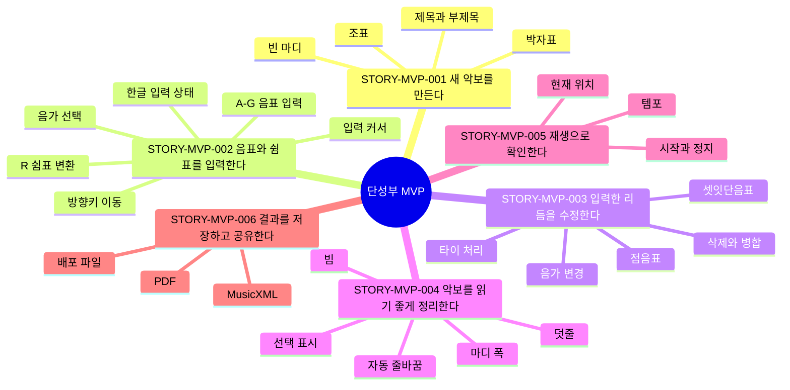

# 제품 스토리 맵

이 문서는 in C의 현재 사용자 여정과 제품 기준을 한눈에 보기 위한 지도다.
긴 히스토리나 논쟁을 남기는 문서가 아니라, 지금 합의된 상태만 유지한다.

## 문서 용도

- MVP와 이후 기능을 사용자 여정 기준으로 판단한다.
- 이슈 작업 전후로 어떤 사용자 흐름이 바뀌는지 확인한다.
- 사람과 AI Agent가 같은 제품 기준을 보고 작업하게 한다.
- 테스트 문서와 자동 검증이 어떤 사용자 성공 흐름을 보호하는지 연결한다.

AI Agent가 작업 전후에 이 문서를 확인하고 갱신하는 절차는
`docs/product/agent-workflow.md`에 정리한다.

## 관리 원칙

- 이 문서에는 현재 기준만 남긴다.
- 변경 배경, 논의, 히스토리는 GitHub 이슈와 PR에 남긴다.
- 스토리가 먼저 바뀌어야 하면 변경 제안 이슈를 만든다.
- 작업 중 기준이 바뀌면 해당 이슈 댓글로 보강한다.
- PR에서는 이 문서의 기준 변경 여부를 확인한다.
- 기준이 바뀌었다면 PR 안에 이 문서 변경을 포함한다.

## 스토리 ID 규칙

스토리 ID는 `STORY-{AREA}-{NNN}` 형식을 쓴다.

- `MVP`: 단성부 MVP 사용자 여정
- `EDIT`: 편집 경험 전반
- `LAYOUT`: 악보 배치와 사보 품질
- `IO`: 저장, 불러오기, 내보내기
- `PLAY`: 재생과 청취 확인

한 번 사용한 ID는 의미가 크게 바뀌어도 재사용하지 않는다. 스토리가 폐기되면
이 문서에서 제거하고, 폐기 이유는 관련 이슈에 남긴다.

## 단성부 MVP 지도



## 현재 스토리 기준

스토리 항목은 `사용자`, `목표`, `흐름`, `기대 결과`, `지원 상태`,
`검증 연결`, `관련 문서`만 유지한다. 변경 기록, 논쟁, 대안은 관련 이슈와
PR에 남긴다.

### STORY-MVP-001: 새 악보를 만든다

사용자:

- 한국어로 앱을 쓰며 처음 사보 도구를 접하는 초보 음악인.
- 기존 템플릿 없이 짧은 단성부 악보를 빠르게 시작하려는 사용자.

목표:

- 빈 악보에서 시작해 제목, 부제목, 박자표, 조표가 있는 단성부 악보를 만든다.

흐름:

1. 시작화면에서 새 악보 만들기를 선택한다.
2. 제목과 부제목을 확인하거나 수정한다.
3. 박자표를 선택한다.
4. 조표를 선택한다.
5. 필요한 경우 생성 후 박자표나 조표를 변경한다.
6. 빈 마디가 선택 가능한 쉼표 상태로 표시되는지 확인한다.

기대 결과:

- 사용자는 첫 음표를 입력하기 전에 악보의 기본 정보를 이해할 수 있다.
- 사용자는 앱을 켠 직후 새 악보, MusicXML 가져오기, 복구본 열기 중 시작 행동을
  고를 수 있다.
- 박자표와 조표가 악보 첫 system에 명확히 표시된다.
- 비어 있는 마디는 사용자가 편집할 수 있는 음악 시간으로 보인다.

현재 기준:

- 새 악보 생성 시 박자표와 조표를 선택할 수 있다.
- 일반 실행에서는 시작화면을 먼저 보여주고, fixture 검증 모드는 기존처럼 악보를
  바로 연다.
- 생성 후에도 박자표와 조표를 바꿀 수 있어야 한다.
- 생성된 악보의 제목과 부제목을 수정할 수 있다.
- 비어 있는 마디는 해당 박자표의 한 마디 전체를 나타내는 쉼표로 보인다.
- full-measure rest는 실제 박자 길이와 표기 관례를 구분해 다룬다.

지원 상태:

- 지원됨: 시작화면, 제목/부제목 수정, 박자표 선택, 조표 선택.
- 부분 지원: 생성 후 박자표/조표 변경, full-measure rest의 표시와 실제 박자
  길이 분리.
- 부족함: 새 악보 설정 흐름의 세부 검증과 오류 복구 안내.

검증 연결:

- `npm test`: 박자표 길이에 맞는 measure exact-fill 검증.
- `npm run verify:mvp`: 기본 fixture의 time/key signature와 event SVG 매핑 검증.

관련 문서:

- `docs/research/single-voice-mvp-requirements.md`
- `docs/architecture/rhythmic-timeline.md`

### STORY-MVP-002: 음표와 쉼표를 입력한다

사용자:

- 마우스보다 키보드로 빠르게 단선율을 입력하고 싶은 사용자.
- 한국어 입력 상태에서도 기본 단축키가 끊기지 않기를 기대하는 사용자.

목표:

- 음가를 고르고, 음표와 쉼표를 입력하며, 마지막 이벤트 뒤에 계속 새 이벤트를
  추가한다.

흐름:

1. 숫자키나 툴바로 음가를 선택한다.
2. 음표 선택 상태에서 `A`-`G`로 음높이를 바꾼다.
3. 쉼표 선택 상태에서 `A`-`G`로 같은 음가의 음표로 바꾼다.
4. 음표 또는 쉼표 선택 상태에서 `R`로 같은 음가의 쉼표로 바꾼다.
5. 오른쪽 화살표로 다음 이벤트를 선택한다.
6. 마지막 이벤트 뒤에서는 입력 커서가 표시된다.
7. 입력 커서에서 `A`-`G` 또는 `R`로 새 음표나 쉼표를 추가한다.

기대 결과:

- 사용자는 마우스 없이 짧은 멜로디를 이어서 입력할 수 있다.
- 선택 상태와 새 입력 커서 상태가 시각적으로 구분된다.
- 쉼표가 포함되어도 이후 음표 입력 흐름이 막히지 않는다.

현재 기준:

- 숫자키 `1`-`5` 또는 툴바로 현재 음가를 선택한다.
- 음표 선택 상태에서 `A`-`G`를 누르면 선택 음표의 음높이가 바뀐다.
- 쉼표 선택 상태에서 `A`-`G`를 누르면 같은 음가의 음표로 바뀐다.
- 음표 또는 쉼표 선택 상태에서 `R`을 누르면 같은 음가의 쉼표로 바뀐다.
- 마지막 이벤트에서 오른쪽 화살표를 누르면 새 입력 커서가 표시된다.
- 새 입력 커서에서 `A`-`G`를 누르면 현재 음가의 음표가 추가된다.
- 새 입력 커서에서 `R`을 누르면 현재 음가의 쉼표가 추가된다.
- 한글 입력 상태에서도 핵심 단축키가 동작해야 한다.

지원 상태:

- 지원됨: 음가 선택, `A`-`G` 음표 입력/변환, `R` 쉼표 변환, 입력 커서.
- 부분 지원: 한글 입력 상태의 모든 핵심 단축키 대응.
- 부족함: 사용자가 입력 모드를 직관적으로 이해하도록 돕는 UI 안내.

검증 연결:

- `npm test`: 순차 입력 후 마디 이동과 새 마디 생성 검증.
- `npm run verify:mvp`: 선택 가능한 SVG event와 입력 위치 좌표 검증.

관련 문서:

- `docs/architecture/note-input-state.md`
- `docs/brand/korean-product-language.md`

### STORY-MVP-003: 입력한 리듬을 수정한다

사용자:

- 입력한 멜로디의 리듬을 다시 다듬는 사용자.
- 쉼표, 점음표, 셋잇단음표, 타이가 섞인 단성부 악보를 편집하려는 사용자.

목표:

- 이미 입력된 음표와 쉼표의 길이를 바꾸고, 삭제하고, 점음표와 셋잇단음표를
  사용하면서 마디 길이를 유지한다.

흐름:

1. 수정할 음표나 쉼표를 선택한다.
2. 숫자키나 툴바로 음가를 바꾼다.
3. 점음표 또는 셋잇단음표를 적용한다.
4. 필요하면 `Backspace`로 이벤트를 삭제한다.
5. 삭제된 길이가 앞 이벤트에 가산되거나, 첫 이벤트라면 뒤 이벤트가 당겨지는지
   확인한다.
6. 마디 길이와 표기 가능한 리듬이 유지되는지 확인한다.

기대 결과:

- 사용자는 쉼표가 늘어나도 편집 흐름이 막히지 않는다.
- 삭제는 음표를 쉼표로 바꾸는 동작과 명확히 구분된다.
- 리듬 수정 후에도 마디는 정확한 길이로 채워진다.

현재 기준:

- 선택한 음표나 쉼표의 음가는 직접 바꿀 수 있다.
- 짧게 바꾼 뒤 남는 시간은 유효한 쉼표로 채운다.
- 길게 바꿀 때는 뒤 이벤트를 소비하거나, 불가능한 경우 명확히 거부한다.
- `Backspace`는 음표를 쉼표로 바꾸지 않는다.
- 삭제된 길이는 앞 이벤트에 가산한다.
- 악보 첫 이벤트를 삭제하면 뒤 이벤트가 앞으로 당겨진다.
- 타이로 연결된 음표와 인접 구간을 삭제하면 남은 타이 관계가 유효하게 정리된다.
- Shift 선택, Shift+화살표, 드래그로 연속 이벤트 범위를 선택할 수 있어야 한다.
- 셋잇단음표는 선택 상태와 입력 커서 상태 모두에서 다룰 수 있어야 한다.
- 셋잇단음표를 다시 토글하면 해제할 수 있어야 한다.

지원 상태:

- 지원됨: 음가 변경, 삭제와 앞 이벤트 병합, 타이 인접 구간 삭제, 점음표,
  셋잇단음표 기본 입력, 이벤트 범위 선택 모델과 시각화.
- 부분 지원: 셋잇단음표 해제와 예외 상황 안내.
- 부족함: 범위 선택 기반 삭제와 일괄 리듬 편집 UX.

검증 연결:

- `npm test`: duration 변경, 삭제, undo/redo, tuplet/tie 관계 검증.
- `npm run verify:mvp`: tuplet과 tie SVG 그룹 생성 및 event 좌표 검증.

관련 문서:

- `docs/architecture/delete-rest-policy.md`
- `docs/architecture/rhythm-editing-transactions.md`
- `docs/architecture/augmentation-dots.md`
- `docs/architecture/tuplets.md`
- `docs/architecture/ties-and-measure-splitting.md`

### STORY-MVP-004: 악보를 읽기 좋게 정리한다

사용자:

- 입력한 악보가 실제 연주자가 읽을 수 있는 형태인지 확인하려는 사용자.
- 화면 폭이 달라져도 오선과 마디가 자연스럽게 배치되기를 기대하는 사용자.

목표:

- 입력한 단성부 악보를 읽을 수 있는 오선보로 확인하고, 줄바꿈과 빔이 무너지지
  않게 유지한다.

흐름:

1. 여러 마디의 단성부 멜로디를 입력한다.
2. 화면 폭에 따라 system이 자동으로 나뉘는지 확인한다.
3. 각 system의 마디가 사용 가능한 폭을 자연스럽게 채우는지 확인한다.
4. 8분음표 이하 음표가 박자 구조에 맞게 빔으로 묶이는지 확인한다.
5. 높은 음역과 낮은 음역의 덧줄이 잘리지 않는지 확인한다.

기대 결과:

- 한 system의 마지막 마디가 짧게 쪼그라들지 않는다.
- 빔, 덧줄, 선택 표시가 악보를 읽는 데 방해되지 않는다.
- desktop과 최소 지원 폭 모두에서 음악 이벤트가 마디 영역 안에 그려진다.

현재 기준:

- system 줄바꿈은 자동으로 적용된다.
- 각 system의 마지막 마디도 사용 가능한 전체 폭을 채운다.
- 마디 폭은 음악 내용과 최소 간격을 모두 고려한다.
- 8분음표 이하 음표는 박자 구조를 기준으로 자동 빔 처리된다.
- 오선 범위를 벗어난 음표도 덧줄과 함께 잘리지 않아야 한다.
- 선택된 이벤트와 입력 커서는 시각적으로 구분되어야 한다.

지원 상태:

- 지원됨: 자동 system 줄바꿈, 마지막 마디 폭 채움, 기본 빔, 덧줄 렌더링.
- 부분 지원: 더 복잡한 박자표와 리듬 묶음에서의 빔 안정성.
- 부족함: 수동 system/page break와 페이지 레이아웃 설정.

검증 연결:

- `npm run verify:mvp`: desktop/minimum viewport의 system 배치와 SVG 좌표 검증.
- `npm test`: 자동 빔과 timeline 정렬 검증.

관련 문서:

- `docs/architecture/measure-systems.md`
- `docs/architecture/automatic-beaming.md`
- `docs/architecture/measure-selection.md`

### STORY-MVP-005: 재생으로 확인한다

사용자:

- 입력한 악보가 의도한 길이와 흐름으로 들리는지 확인하려는 사용자.
- 재생 중에도 편집 상태가 혼란스럽게 바뀌지 않기를 기대하는 사용자.

목표:

- 작성 중인 악보를 재생하고, 템포를 조절하며, 타이와 셋잇단음표가 실제 길이에
  반영되는지 확인한다.

흐름:

1. 재생 버튼을 누른다.
2. 템포를 조절한다.
3. 일시정지 또는 정지한다.
4. 재생 후 선택 상태와 입력 위치가 예측 가능하게 유지되는지 확인한다.

기대 결과:

- 사용자는 악보를 저장하거나 내보내기 전에 소리로 흐름을 확인할 수 있다.
- 타이와 셋잇단음표가 표기와 같은 길이로 들린다.
- 재생 상태가 편집 상태를 임의로 바꾸지 않는다.

현재 기준:

- 재생, 일시정지, 정지를 사용할 수 있다.
- 템포를 조절할 수 있다.
- 재생 중에도 선택과 입력 상태가 예측 가능하게 유지되어야 한다.
- 타이와 셋잇단음표가 실제 재생 길이에 반영되어야 한다.

지원 상태:

- 지원됨: 기본 재생, 일시정지, 정지, 템포 조절.
- 부분 지원: 타이와 셋잇단음표의 playback timeline 반영.
- 부족함: 재생 커서와 편집 선택의 세밀한 동기화 UX.

검증 연결:

- `npm test`: 타이 병합과 tuplet 비율을 포함한 playback 시작 시각 검증.

관련 문서:

- `docs/research/single-voice-mvp-requirements.md`
- `docs/testing/single-voice-mvp-regression.md`

### STORY-MVP-006: 결과를 저장하고 공유한다

사용자:

- 작성한 악보를 다른 사보 도구와 주고받으려는 사용자.
- 배포된 앱에서 결과물을 파일로 남기고 공유하려는 사용자.

목표:

- 작성한 악보를 MusicXML 또는 PDF로 내보낸다.

흐름:

1. MusicXML을 가져오거나 새 악보를 작성한다.
2. 작성한 악보를 MusicXML로 내보낸다.
3. 필요한 경우 PDF로 변환한다.
4. 배포 빌드에서도 같은 흐름이 동작하는지 확인한다.

기대 결과:

- MusicXML로 다른 도구와 주고받을 수 있다.
- MusicXML 가져오기, MusicXML 내보내기, PDF 변환은 사용자가 구분할 수 있는
  별도 행동으로 제공된다.

현재 기준:

- 첫 공개와 단성부 MVP에서는 전용 프로젝트 파일보다 MusicXML 흐름을 우선한다.
- MusicXML로 가져오기와 내보내기를 할 수 있어야 한다.
- PDF 변환은 MusicXML 내보내기와 구분되는 별도 기능으로 다룬다.
- 배포 빌드에서도 저장과 내보내기 흐름이 동작해야 한다.

지원 상태:

- 지원됨: 시작화면의 새 악보/가져오기/복구본 선택, MusicXML 가져오기와 내보내기
  기본 흐름, PDF 변환, 파일 작업 UI의 저장/내보내기 용어 분리, 앱 내부 자동저장
  복구.
- 부분 지원: 배포 빌드에서의 파일 흐름.
- 부족함: 최근 파일과 예제 악보 같은 확장 진입점.

검증 연결:

- `npm test`: MusicXML 왕복 후 ID와 무관한 음악 의미 동등성 검증.
- `npm run verify:package`: 패키징된 앱 시작화면과 preload bridge smoke test.

관련 문서:

- `docs/musicxml-mvp.md`
- `docs/architecture/project-file.md`
- `docs/distribution.md`

## 스토리 영향도 확인 규칙

이슈와 PR은 기능 단위만이 아니라 사용자 여정 기준으로도 확인한다. 변경 히스토리는
이슈와 PR에 남기고, 이 문서에는 최종 합의된 현재 기준만 반영한다.

### 이슈 작성 시

이슈를 만들 때 다음 질문을 확인한다.

- 기존 스토리에 포함되는 작업인가?
- 새 스토리가 필요한 작업인가?
- 사용자의 목표, 흐름, 기대 결과 중 하나가 바뀌는가?
- 단축키, 입력 방식, 선택 상태, 오류 메시지, 저장/내보내기 흐름이 바뀌는가?
- 기존 검증 스크립트가 이 변경을 보호하는가, 아니면 새 검증이 필요한가?

이슈 본문에는 다음 중 하나를 적는다.

- `스토리 영향 없음`: 내부 리팩터링, 문구 오탈자처럼 사용자 흐름이 바뀌지 않는 경우.
- `영향 스토리: STORY-MVP-002`: 기존 스토리 기준 안에서 작업하는 경우.
- `새 스토리 필요`: 기존 스토리로 설명하기 어려운 사용자 흐름이 생기는 경우.

스토리 기준 자체를 바꾸는 이슈라면 변경 배경과 대안을 이슈 본문 또는 댓글에
남긴다.

### PR 작성 시

PR을 만들 때 다음 질문을 확인한다.

- 영향을 받은 스토리 ID를 적었는가?
- 스토리 맵의 현재 기준과 실제 동작이 달라졌는가?
- 달라졌다면 관련 이슈에 변경 이유가 남아 있는가?
- 달라진 최종 기준이 이 문서에 반영되어 있는가?
- 검증 스크립트나 수동 확인이 스토리의 기대 결과를 확인하는가?

PR 본문에는 다음 형식을 사용한다.

```md
## 스토리 영향도

- 영향 스토리: STORY-MVP-002
- 스토리 맵 변경: 있음/없음
- 변경 이유: 관련 이슈 또는 PR 설명 참고

## 검증

- `npm test`
- `npm run verify:mvp`
```

변경이 없으면 PR 설명에 `스토리 영향 없음`이라고 적는다. 변경이 있으면
영향받은 스토리 ID를 적고 이 문서를 함께 수정한다.
